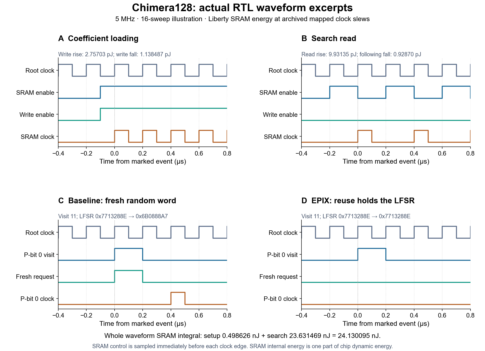
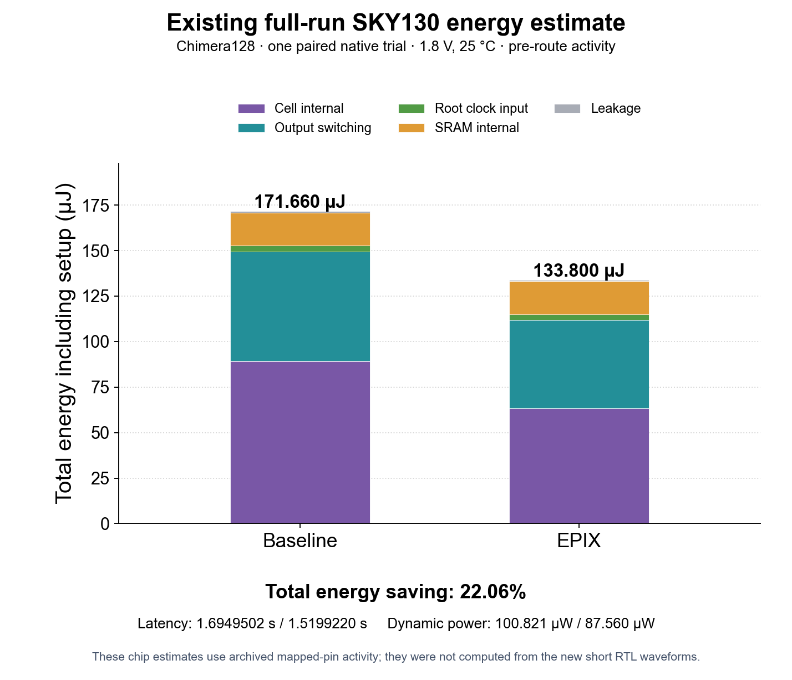

# Chimera128 waveform and energy example

The VCDs show actual 16-sweep RTL runs. They support the SRAM calculation below. Complete chip numbers come from a separate archived mapped run.

**Tool roles:** Yosys maps RTL. Verilator simulates it. OpenSTA uses mapped activity and Liberty tables to estimate power. Cycles give latency; cell counts give area.

| File | Purpose |
|---|---|
| [run.py](run.py) | Regenerate both waveforms with Verilator; see `--help`. |
| [baseline.vcd](baseline.vcd), [epix.vcd](epix.vcd) | SRAM, LFSR, p-bit and measurement signals. |
| [estimate.py](estimate.py) | Count waveform events and calculate energy/area. |
| [plot.py](plot.py) | Draw figures; needs Matplotlib and NumPy. |
| [native_results.json](native_results.json) | Archived mapped results and source hashes. |
| [results.json](results.json) | Recalculated waveform and archived chip results. |
| [waveform.png](waveform.png), [energy.png](energy.png) | Waveform excerpts and chip-energy breakdown. |

Recalculate the delivered example from the package root:

```bash
python3 area_energy/example/estimate.py
python3 area_energy/example/plot.py
```



Panels A/B show SRAM operations. C/D show p-bit 0: baseline advances its LFSR; EPIX holds its clock and state during reuse. Both simulations passed reference checks.

Count controls just before each clock edge. Liberty provides energy per edge at the archived rise/fall slews of **0.339123/0.178619 ns**. RTL waveforms provide counts, not physical slew.

| SRAM event | Edges | Energy per edge (pJ) |
|---|---:|---:|
| Setup rise/fall, `ce=1,we=1` | 128 each | 2.757030 / 1.138487 |
| Search rise, `ce=1,we=0` | 2,176 | 9.931350 |
| Search fall, `ce=0,we=0` | 2,176 | 0.928700 |

```text
SRAM energy = [128 × (2.757030 + 1.138487)
             + 2176 × (9.931350 + 0.928700)] / 1000
            = 24.130095 nJ
EPIX latency = 10,281 cycles × 200 ns = 2056.2 µs
SRAM average internal power = 24.130095 / 2056.2 = 0.011735 mW
```

`measure=1` marks the interval; `search=0/1` selects setup/search. Both modes perform the same SRAM operations here. This integral covers SRAM internal energy only; chip power also includes switching, leakage and logic.



The archived complete run has one paired trial, with a target hit in both modes. The short VCDs did not produce these chip estimates.

| Quantity, including setup | Baseline | EPIX |
|---|---:|---:|
| Latency (µs) | 1,694,950.2 | 1,519,922.0 |
| Dynamic energy (nJ) | 170,886.074 | 133,084.263 |
| Leakage energy (nJ) | 773.831 | 715.577 |
| Total energy (nJ) | 171,659.906 | 133,799.840 |
| Standard-cell area (µm²) | 492,651.2416 | 532,767.2160 |
| SRAM area (µm²) | 108,741.0000 | 108,741.0000 |
| Total area (µm²) | 601,392.2416 | 641,508.2160 |

For EPIX, dynamic energy is `0.087559929 mW × 1519922 µs ≈ 133084.263 nJ`. Add leakage to get `133799.840 nJ`. Area is `532767.216 + 108741.000 = 641508.216 µm²`.

These estimates include SRAM once, on-chip loading, initialization and search. They exclude host energy and routed-wire/glitch effects. See [the evaluation guide](../README.md) to generate new chip results.
