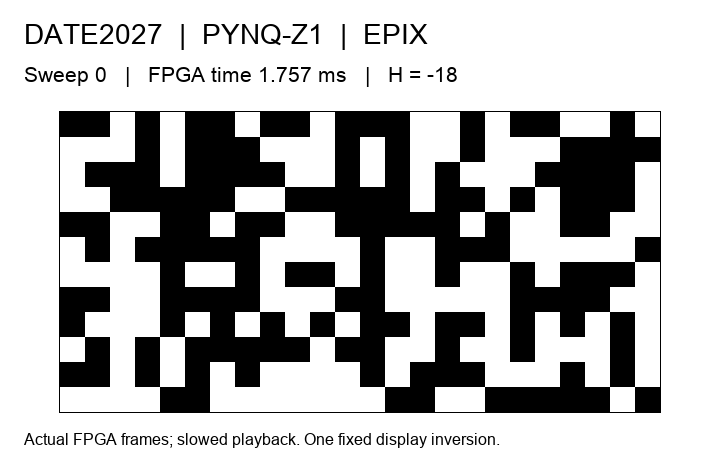

# DATE2027 on a real PYNQ-Z1 FPGA

A **288-variable (24 × 12 pixel)** signed-Max-Cut demo that converges to **DATE / 2027**. IID and EPIX run on the FPGA at 100 MHz using the same bitstream and one shared LFSR.



Actual FPGA frames, with slowed playback. This is a planted example with a known optimum; the image and its global inverse are both valid solutions.

## Try it in software

Requires Python 3.8+, NumPy and a C++14 compiler available as `c++`. From this directory:

```sh
python3 -m pip install -r hex_generation/requirements.txt
python3 verify.py
python3 software/run.py --trials 100 --output runs/software_100
```

This runs both policies and compares all outputs with the bundled reference. Use `--trials 1` for a quick test. The output directory must be new.

## Run on PYNQ-Z1

Tested with **PYNQ 2.1 and Python 3.6**. From this repository directory, copy the complete demo:

```sh
rsync -av --exclude=.git ./ <user>@<board>:~/jupyter_notebooks/date2027_text288/
```

Open [IID Demo.ipynb](lfsr_iid/Demo.ipynb) or [EPIX Demo.ipynb](lfsr_epix/Demo.ipynb) in the board's hardware-enabled Jupyter kernel. Start with `trials = 1`. The notebook programs and runs the FPGA; run one hardware notebook at a time.

Alternatively, from either policy folder:

```sh
python3 run.py --check
sudo /opt/python3.6/bin/python3.6 run.py --trials 1
sudo /opt/python3.6/bin/python3.6 run.py --mode paired --trials 100
```

`--check` verifies files without programming the FPGA. The folder selects the default policy; `--mode paired` runs both. The limit is **100 trials per policy**, each using 1024 full sweeps.

Results appear in `runs/<run-id>/`. Read `SUMMARY.json` for averages and `trials.jsonl` for individual results and captured frames. The notebook also displays convergence.

## Recorded results

| Policy | Exact-target hits | Mean RNG words | Mean full-run FPGA time |
|---|---:|---:|---:|
| IID | 78/100 | 295200 | 1812.52 ms |
| EPIX | 100/100 | 149798.97 | 1764.53 ms |

All 200 campaign trials and six smoke trials matched the independent software reference, including every captured frame. These results describe this planted instance. See [RESULTS.md](RESULTS.md) for details.

## Files and further details

`lfsr_iid/` and `lfsr_epix/` each contain a notebook, runner, matching BIT/HWH/Tcl files and `vivado/` rebuild sources. `software/` contains the reference model; `recorded/` and `figures/` contain the measured results.

See the [technical reference](REFERENCE.md) for ROM generation, Vivado rebuilds, additional checks, problem formulation and the trace interface. [VALIDATION.json](VALIDATION.json) records package checks; [MANIFEST.json](MANIFEST.json) lists file hashes.
